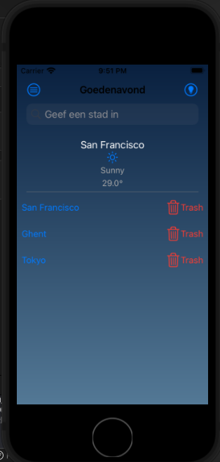
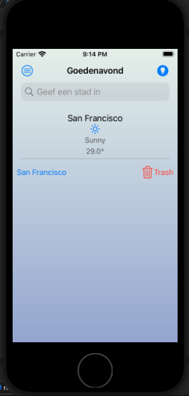
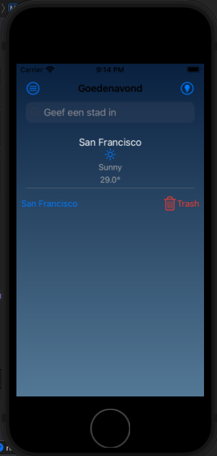
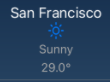
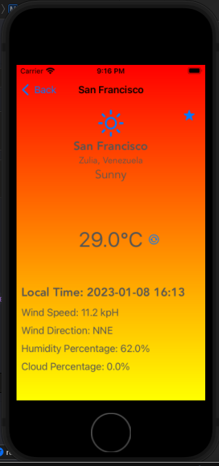
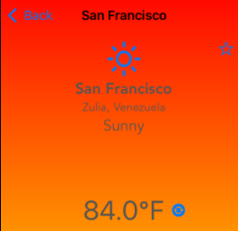
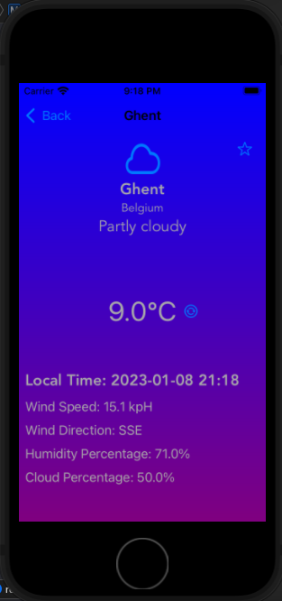
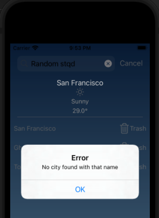
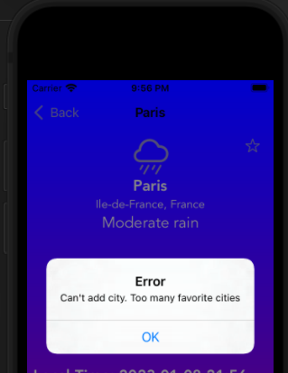

# Weather App voor MADiOS

Een weerapp dat het weer kan tonen van elke stad die je meegeeft.

## Info

Dit is een iOS app gemaakt in Xcode 13.1 in een macOS Monterey VM. De app maakt gebruikt van de [WeatherAPI](https://www.weatherapi.com/) API. 

## Features

Dit is het scherm waarmee de app start. Hierin kan je het weer van andere steden gaan zoeken en steden die je toegevoegd hebt aan je favorieten kan vinden. Je kan het thema veranderen naar een donkere kleur via het lampknopje rechtsboven. Er is een menuknop in de linkerbovenhoek maar de menuitems zijn niet functioneel.

Bij het eerst opstarten van de app zal er gevraagd worden om locatiepermissies. Hierdoor wordt er direct bepaald in welke stad het apparaat zich bevindt en toont het wat basisinfo over het weer op de homepage.

Door op een stad te klikken bij favorieten of door een stad te gaan zoeken via de searchbar kom je op nieuwe pagina. Hier vindt je alle details over het weer van de gegeven stad.

Rechtsboven heb je een knop om de stad toe te voegen aan favorieten(max. 8 favoriete steden). Er is ook een knop naast de temperatuur om het om te zetten naar Fahrenheit.

De achtergrond veranderd ook op basis van temperatuur en of het zonnig is.

Als je een verkeerde stad ingeeft of als je meer dan 8 steden probeert toe te voegen zal je een errormelding krijgen

## Errors

